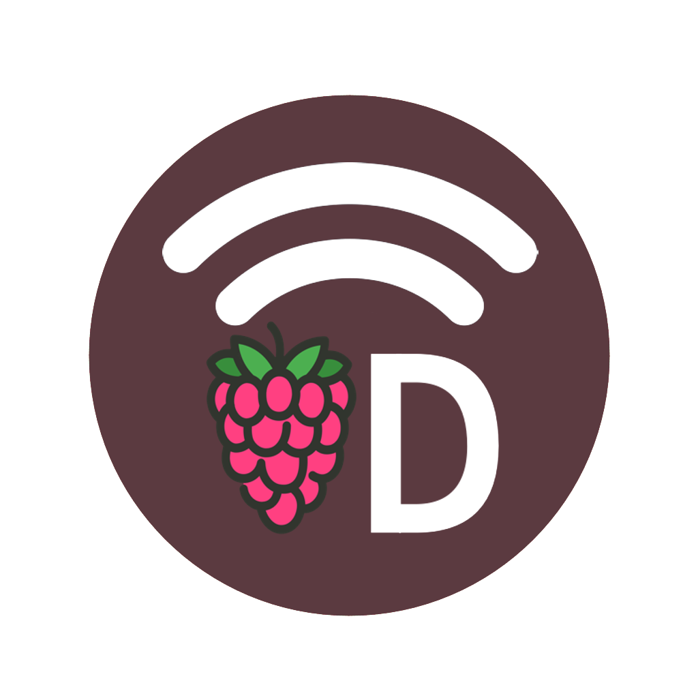

<p style="text-align: center;">


# VD Connect

[English](README.md) | [Polski](README_pl.md) | [中文](README_zh.md)
</p>
A companion app for our Raspberry Pi based workstation project. It displays the current status and parameters of the
workstation. It also allows implementation of custom commands, that can be used to control Raspberry Pi board.

## Installation

You can download VD Connect app from [releases page](https://github.com/JanStefanski/VD-Connect/releases/latest) and
install to your device.

## Building from source

### Prerequisites

To build the app from source for Android you need the following:

- [Android SDK](https://developer.android.com/studio/index.html)
- [Java JDK](https://www.oracle.com/java/technologies/javase/downloads.html)
- [Flutter](https://flutter.dev)

To build the app from source for iOS you need the following:

- [Xcode](https://developer.apple.com/download/)
- [Flutter](https://flutter.dev)

You also need to install and configure backend on the Raspberry
Pi. [You can get the server code here](https://github.com/JanStefanski/VD-Connect-Server)

### Cloning and configuration

After you have all of the above installed and configured, you can clone the repository and enter the project folder:

```shell
git clone https://github.com/JanStefanski/VD-Connect.git
cd VD-Connect
```

Then to install the dependencies, run the following command:

```shell
flutter pub get
```

After that you can run the app by running the following command:
```shell
flutter run
```

### Troubleshooting

To put the android app into debug mode and run it on a device, you need to edit the `/android/app/build.gradle` file and change the following:
```
    buildTypes {
        release {
            signingConfig signingConfigs.release // <-- change "release" to "debug"
        }
    }
```

In case of build errors check [Flutter documentation](https://flutter.dev/docs/) for more help.
