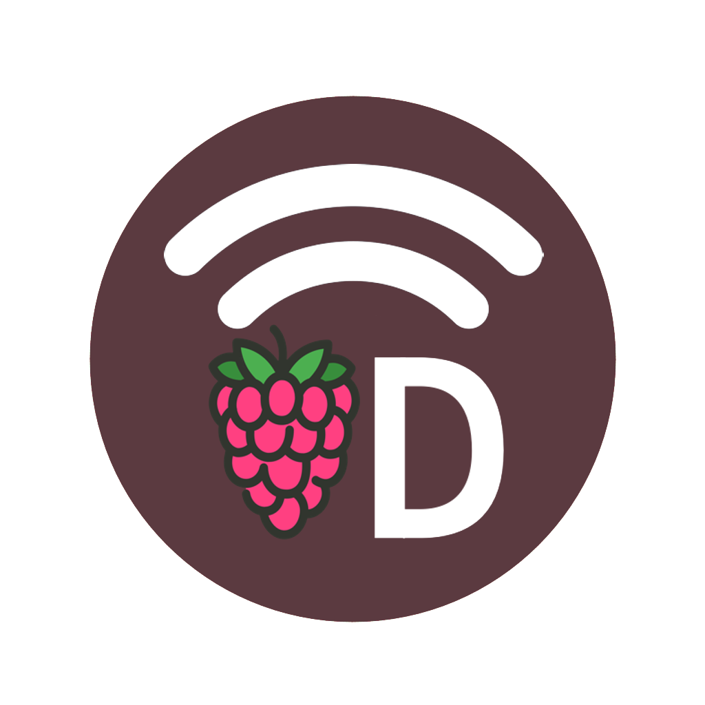

<p align="center">

# VD伴侣应用

[中文](README_zh.md) | [English](README.md) | [Polski](README_pl.md)
</p>

这是VD连接应用程序。它是一个websocket服务器，它被设计为在Raspberry Pi上运行，并且提供VD连接应用程序与设备信息。

## 安装

你可以从[releases](https://github.com/JanStefanski/VD-Connect/releases/latest)网站下载申请VD连接应用程序。

## 从源码编译

### 所需依赖项

要从源头上为安卓系统编译VD连接应用程序，你需要下载:

- [Android SDK](https://developer.android.com/studio/index.html)
- [Java JDK](https://www.oracle.com/java/technologies/javase/downloads.html)
- [Flutter](https://flutter.dev)

并且安装它。

要从源头上为iOS系统编译VD连接应用程序，你需要下载:

- [Xcode](https://developer.apple.com/download/)
- [Flutter](https://flutter.dev)

并且安装它。

你还需要安装并配置Raspberry Pi的后端服务。[你可以从这里下载服务代码](https://github.com/JanStefanski/VD-Connect-Server)

### 克隆并配置

你可以从GitHub上克隆VD连接应用程序，并进入项目目录:
```shell
git clone https://github.com/JanStefanski/VD-Connect.git
cd VD-Connect
```

然后运行下面的命令来安装依赖项:
```shell
flutter pub get
```

然后运行下面的命令来运行应用程序:
```shell
flutter run
```

### 问题解决

为了让你的安卓应用进入调试模式并禁用代码签名，你需要在`/android/app/build.gradle` 文件中修改以下内容:
```
    buildTypes {
        release {
            signingConfig signingConfigs.release // <-- 改变这一行"release"为"debug"
        }
    }
```

如果发生错误，请检查[Flutter文档](https://flutter.dev/docs/)中的错误提示。
